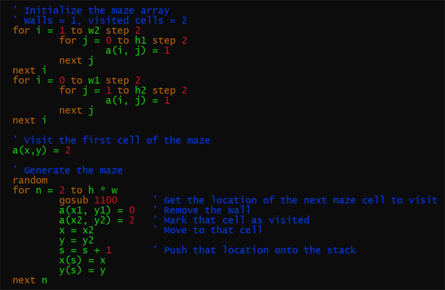
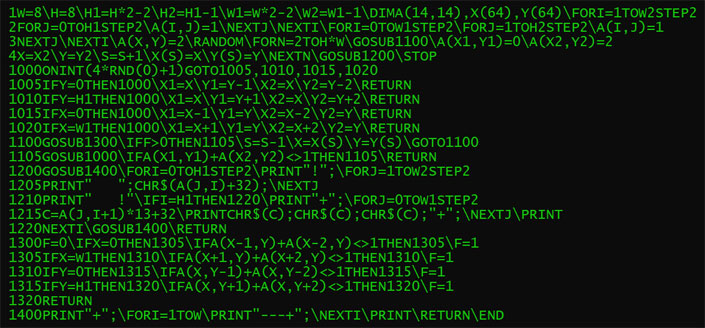

B8PP -- BASIC8 preprocessor for PDP8 TSS8 or OS8
==========

This utility will take BASIC8 source for PDP8 TSS8 or OS8 in a somewhat modern format and prepare it 
for use on a PDP8.  It will:

* convert the source to upper case,
* remove comments,
* assign missing line numbers,
* concatenate lines,
* consolidate DATA statements,
* and remove extraneous whitespace.

Don't let the modern look of the source before processing fool you: this is still the rather primitive
BASIC8 we know and love from the 60s: you can't get away with any IF/THEN/ELSE or the like.  This is a
preprocessor that merely massages the source; it is not a compiler.

I've included four demo programs; the .txt files are the original source and the .bas files are
the corresponding programs after preprocessing:

* bulls.txt, bulls.bas -- The "Bulls and Cows" game (TSS8 version).
* bulls2.txt, bulls2.bas -- The "Bulls and Cows" game (OS8 version).
* guess.txt, guess.bas -- Classic "Guess a number" game (TSS8 version).
* guess2.txt, guess2.bas -- Classic "Guess a number" game (OS8 version).
* maze.txt, maze.bas -- Generate an 8x8 random maze (TSS8 version).
* maze2.txt, maze2.bas -- Generate a random maze up to 30x30 (OS8 version).
* wumpus.txt, wumpus.bas -- Classic "Hunt the Wumpus" game. (TSS8 or OS8 version).

Example usage: `b8pp < guess.txt > guess.bas`

To be able to paste BASIC code into the SIMH simulator, try putting `set console speed=2400`
in the file `/opt/pidp8i/share/boot/2.script`
