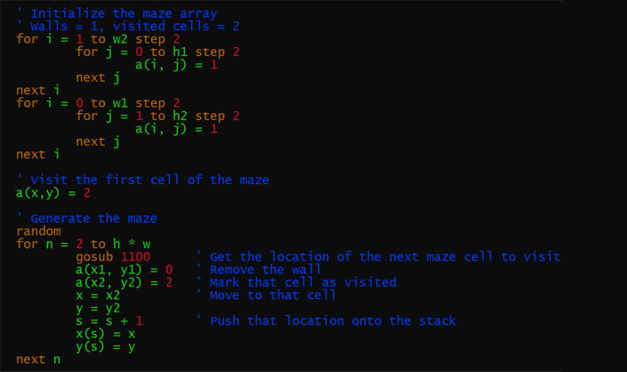

B8PP -- BASIC8 preprocessor for PDP8 TSS8
==========

This utility will take BASIC8 source for the PDP8 TSS8 OS in a somewhat modern format and prepare it 
for use on a PDP8.  It will:

* convert the source to upper case,
* remove comments,
* assign missing line numbers,
* concatenate lines,
* consolidate DATA statements,
* and remove extraneous spaces.

I've included three demo programs; the .txt files are the original source and the .bas files are
the corresponding programs after preprocessing:

* bulls.txt, bulls.bas -- The "Bulls and Cows" game.
* guess.txt, guess.bas -- Classic "guess a number" game.
* maze.txt, maze.bas -- Generate an 8x8 random maze.

Example usage: `b8pp < guess.txt > guess.bas`

To be able to paste BASIC code into the SIMH simulator for the PDP8, try putting `set console speed=2400`
in the file `/opt/pidp8i/share/boot/2.script`
